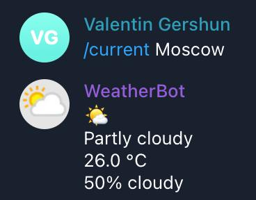

# weather-bot
Telegram bot that tells about current weather and forecast.

# Installing
1. Clone this repository: `git clone https://github.com/valixxx1/weather-bot && cd weather-bot`
2. Create file `telebot.key` and insert the key of your telegram bot: `echo "your_key" > telebot.key`
3. Create file `weather.key` and insert your WeatherApi key: `echo "your_key" > telebot.key`
4. Install all requirements: `pip install -r requirements.txt`
5. Run weather-bot: `python3 main.py`

# Current weather

# Information
This bot is currently in development. Also it is *not* error tolerant now.
You can help the development by putting a star ⭐️

# What will be added
* Weather forecast
    * Command /forecast
* Error processing
* New styles
* Translation into other languages